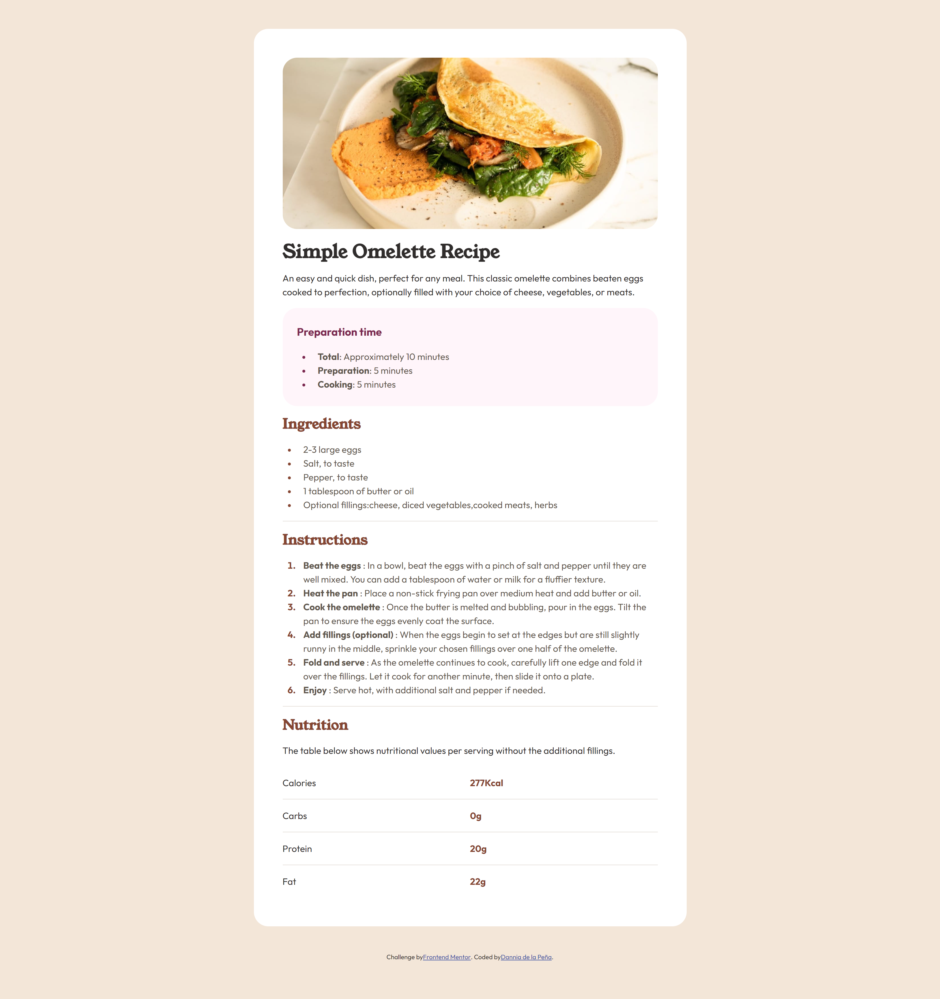

# Frontend Mentor - Recipe page solution

This is a solution to the [Recipe page challenge on Frontend Mentor](https://www.frontendmentor.io/challenges/recipe-page-KiTsR8QQKm). Frontend Mentor challenges help you improve your coding skills by building realistic projects. 

## Table of contents

- [Overview](#overview)
  - [The challenge](#the-challenge)
  - [Screenshot](#screenshot)
  - [Links](#links)
- [My process](#my-process)
  - [Built with](#built-with)
  - [What I learned](#what-i-learned)
  - [Continued development](#continued-development)
- [Author](#author)

## Overview
Website of a recipe made in CSS and HTML

### Screenshot

### Links

- Solution URL: [Add solution URL here](https://your-solution-url.com)
- Live Site URL: [Add live site URL here](https://your-live-site-url.com)

## My process

### Built with

- Semantic HTML5 markup
- CSS custom properties

### What I learned

I learned to use Flexbox better in the nutritional table exercise. Also, I'm learning to group tags or classes that have similar styles.

### Continued development

I would like to make this page again with Grid.

## Author

- Website - [Dannia de la Peña](https://github.com/danniadelap)
- Frontend Mentor - [@danniadelap](https://www.frontendmentor.io/profile/danniadelap)
